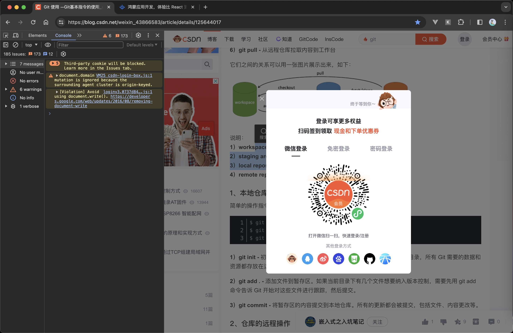
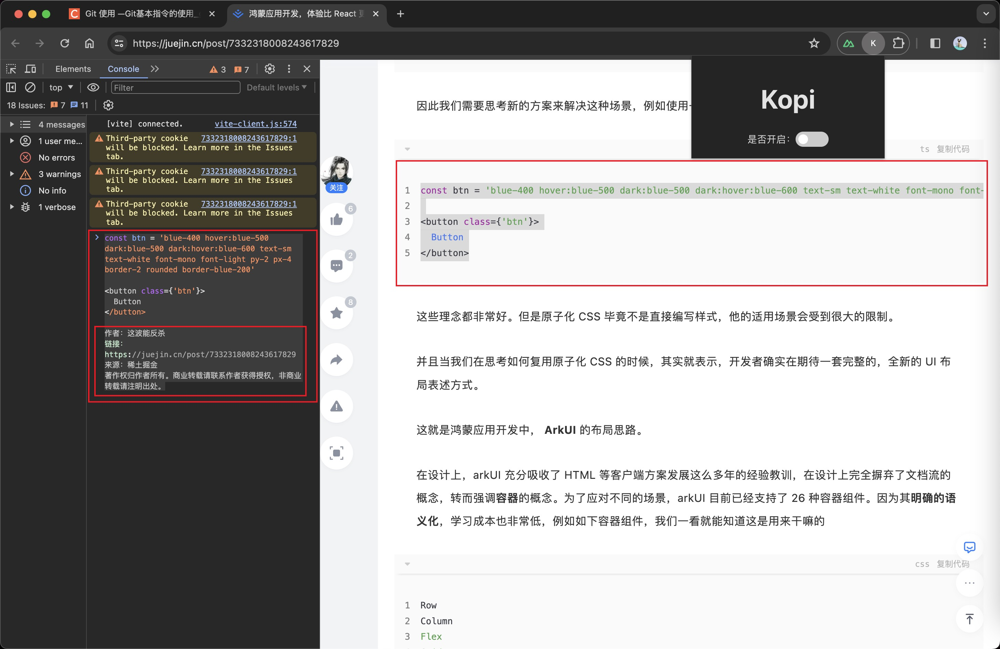
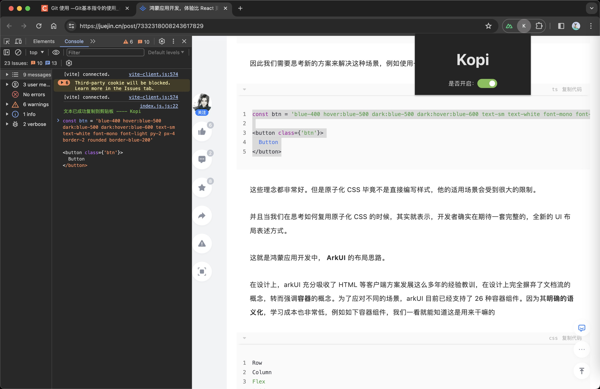

# Kopi 文本复制

## 概览

高效实用的 chrome 页面文本复制扩展。其主要功能有：

- 去除页面禁止选中文字效果
- 去除复制携带的小尾巴
- 去除 csdn 登录弹窗限制
- 免登录一键复制 csdn 代码块内容

可控制开关，快捷操作：

- Window: `Alt+Q`
- Mac: `⌥+Q`

## 效果演示

当我们没有登录 csdn 账号时，禁止选中内容、复制时会弹登录窗口，并且复制不成功，打开 Kopi，即可自由复制！

像掘金复制代码后粘贴代码有时会附带小尾巴，小尾巴信息是我们需要的，打卡 Kopi 复制不会携带！

